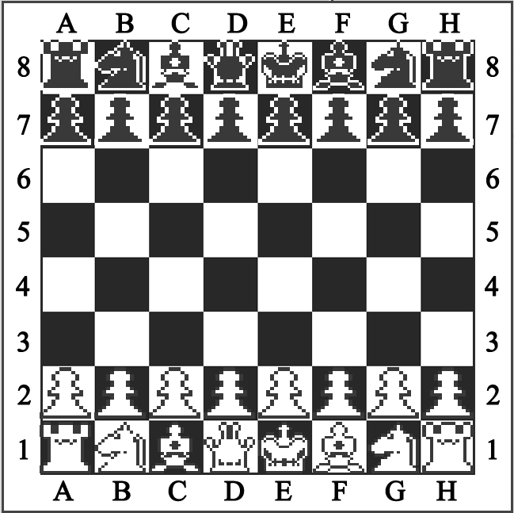

# chessEngine

I'm not that good at chess but I was curious to understand how chess engines are built for computers. This is my attempt at designing and implementing my own chess in Python. The only 3rd party library I will be using is the Pygame library for the graphics. All the chess rules and the AI engine will be built from scratch in Python.

As of right now, this project will support two methods of playing: a local two player match and a single player match against an AI that uses the minmax algorithm. The AI is still quite primitive and is unable to build a tree of significant depth. My next step going forward with this project would be to implement a net play mode where users can play against each other over the internet.

# Screenshot


# Requirements

This software only requires a working Python 3 installation and the Pygame library which can be installed with pip

# Usage

For a simple two player local game:

```
python board_ui.py
```

To play against the AI (in Beta):

```
python board_ui_ai.py
```
